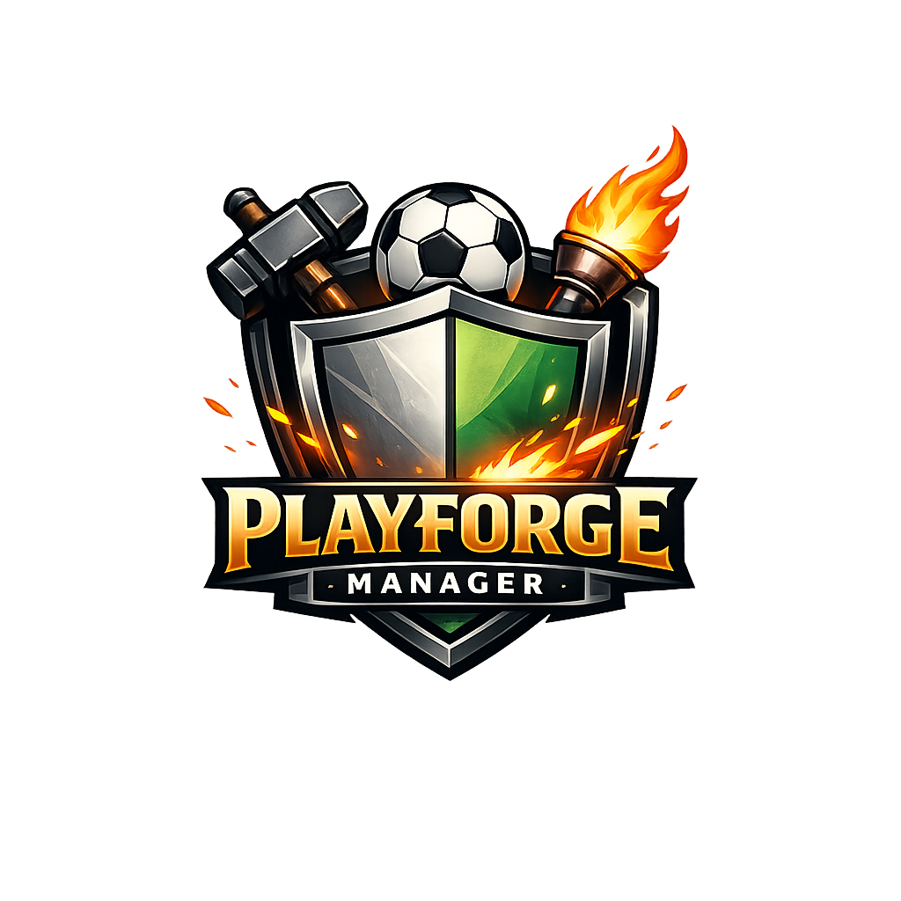

<p align="center">
  
</p>

# PlayForge Manager

PlayForge Manager is a sports manager game written in Java for the CE 216 course. The idea is that you start a new game, pick a sport, and then run a season as the manager of one of the teams in the league. You set the tactic, pick the lineup, advance through the weeks, and watch the standings shift as the matches play out.

The project is built so that the sport you play is not baked into the app. Football was the first sport we put in, and Handball is the second one. Adding another sport later should be a matter of writing a new sport module, not rewriting half of the codebase.

## What you can do

You can start a new game and choose between Football and Handball. After that you get a desktop screen with a sidebar that takes you between the team overview, the squad list, the tactics and lineup screen, the fixture list, the league table, and the match screen. You can save your progress to a file and load it back later. The Tactics screen lets you auto-pick a lineup or switch between a few tactical presets, and the Match screen runs the next match for the team you control. After a match you see the result, the standings impact, and any availability changes for your players.

## Project layout

The code is split into a few packages, each with a clear job:

The `core` package is where the shared abstractions live. Things like `Sport`, `Team`, `Match`, `Lineup`, and `Player` are defined here as interfaces or abstract classes that the rest of the codebase talks to.

The `application` package is the workflow layer. Services like game initialization, weekly progression, match processing, save and load, and the read-only query services for the UI all live here. Anything that wires sports together for the UI goes through this layer.

The `football` and `handball` packages are the actual sport modules. Each one has its own ruleset, scheduler, match engine, season class, factory, and so on. They never talk to the UI directly.

The `infrastructure` package has the JSON save reader and writer plus the in-memory asset provider that gives us team names and player names.

The `ui` package is the JavaFX shell. The screens live in `ui.screens`. The whole UI talks to the application layer only, so it never imports anything from the football or handball packages directly. There is even a small test that fails the build if you try.

The `main` package keeps a console entry point around for older tests, but the real app starts from `ui.PlayForgeApp`.

## What you need to run it

You need Java 17 and Maven. JavaFX comes in as a Maven dependency, so you do not need to install JavaFX separately.

## Running the app

From the project root, run:

```
mvn javafx:run
```

The first time you run it Maven will download JavaFX and the related plugins, after that it just opens the desktop window. The home screen has buttons to start a new game or load a saved one.

## Running the tests

```
mvn test
```

The test suite covers the shared architecture, the save and load round trip for both sports, the per-sport rulesets and engines, the application-layer services, and a small architecture test that makes sure the UI does not reach into the sport modules by accident.

## Save files

The save format is a small JSON file with the extension `.pfm-save.json`. It carries a format id and a version number so an older or unsupported file is rejected with a readable error instead of crashing.

When you save, the active session, the controlled team, the season state, the fixtures, played matches, lineups, tactics, training plans, and player availability all get written out. When you load, the same state comes back and you continue exactly where you left off.

## How to add another sport later

Drop a new module under `com.playforgemanager.<sport>`, write a `SportFactory`, a `Season`, a `MatchEngine`, a `Ruleset`, an `InjuryPolicy`, a `StandingsPolicy`, and a `Scheduler`, and register it in `DefaultSportRegistry` together with a save restorer in `DefaultSaveGameRestorationRegistry` and a team-setup adapter in `DefaultTeamSetupRegistry`. The UI will pick it up without any changes.

## User manual

A short walkthrough of the screens lives in [USER_MANUAL.md](USER_MANUAL.md).
